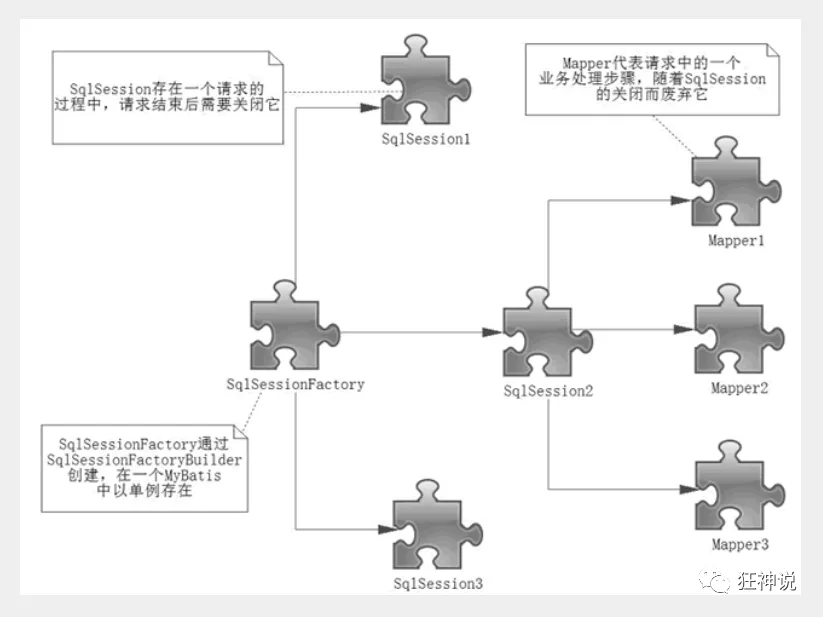
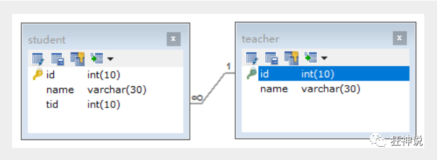

[TOC]
1.什么是框架？

>它是我们软件开发中的一套解决方案，不同的框架解决的是不同的问题
>使用框架的好处：框架封装了很多的细节，使开发者可以使用极简的方式实现功能，大大提高开发效率。

2.三层架构
>表现层：用于展示数据
>业务层：处理业务需求
>持久层：和数据库交互

3.持久层技术解决方案

>JDBC技术：Connection，PreparedStatement，Resultset
>Spring的JDBCTemplate：Spring中对jdbc的简单封装
>Apache的DBUtils：和Spring的JDBCTemplate很像
>但上面都不是框架，JDBC是规范，后两者只是工具类

# 一、mybatis概述
mybatis是一个**持久层**框架，用java编写的。
它封装了jdbc操作的很多细节，使开发者只需要关注sql语句本身，而无需关注注册驱动，创建连接等繁杂过程。
它使用了ORM思想实现了结果集的封装。
>ORM:Object Relational Mapping 对象关系映射
>即：把数据库表和实体类及实体类的属性对应起来，让我们可以操作实体类就实现操作数据库表。

# 二、mybatis的环境搭建

### 1.搭建数据库

```sql
CREATE DATABASE `mybatis`;

USE `mybatis`;

CREATE TABLE `user`(
  `id` INT(20) NOT NULL PRIMARY KEY,
  `name` VARCHAR(30) DEFAULT NULL,
  `pwd` VARCHAR(30) DEFAULT NULL
)ENGINE=INNODB DEFAULT CHARSET`user`=utf8;

INSERT INTO `user`(`id`,`name`,`pwd`) VALUES
(1,'狂神','123456'),
(2,'张三','123756'),
(3,'李四','323489')
```

### 2.创建maven工程并在pom.xml中导入依赖

```xml
<dependencies>
        <dependency>
            <groupId>org.mybatis</groupId>
            <artifactId>mybatis</artifactId>
            <version>3.5.2</version>
        </dependency>
        <dependency>
            <groupId>mysql</groupId>
            <artifactId>mysql-connector-java</artifactId>
            <version>5.1.6</version>
        </dependency>
        <dependency>
            <groupId>log4j</groupId>
            <artifactId>log4j</artifactId>
            <version>1.2.12</version>
        </dependency>
        <dependency>
            <groupId>junit</groupId>
            <artifactId>junit</artifactId>
            <version>4.10</version>
            <scope>test</scope>
        </dependency>
    </dependencies>

```

### 3.创建一个模块（依赖会继承父工程的依赖）

- 编写mybatis的核心配置文件--mybatis-comfig.xml（在resource中）

  ```xml
  <?xml version="1.0" encoding="UTF-8" ?>
  <!DOCTYPE configuration
          PUBLIC "-//mybatis.org//DTD Config 3.0//EN"
          "http://mybatis.org/dtd/mybatis-3-config.dtd">
  <!--核心配置文件-->
  <configuration>
      <environments default="development">
          <environment id="development">
              <transactionManager type="JDBC"/>
              <dataSource type="POOLED">
                  <property name="driver" value="com.mysql.jdbc.Driver"/>
                  <property name="url" value="jdbc:mysql://localhost:3306?serverTimezone=GMT%2B8/mybatis?useSSL=true&amp;useUnicode=true&amp;characterEncoding=UTF-8"/>
                  <property name="username" value="root"/>
                  <property name="password" value="123456"/>
              </dataSource>
          </environment>
      </environments>
  </configuration>
  ```

- 编写mybatis工具类

  ```java
  //sqlSessionFactory构建sqlsession
  public class MybatisUtils {
      private static SqlSessionFactory sqlSessionFactory;
      static {
          try {
              //1.获取sqlSessionFactory对象
              String resource = "mybatis-config.xml";
              InputStream inputStream = Resources.getResourceAsStream(resource);
              sqlSessionFactory = new SqlSessionFactoryBuilder().build(inputStream);
          } catch (IOException e) {
              e.printStackTrace();
          }
      }
      
          //既然有了 SqlSessionFactory，顾名思义，我们可以从中获得 SqlSession 的实例。
          // SqlSession 提供了在数据库执行 SQL 命令所需的所有方法。
          public static SqlSession getSession(){
              return sqlSessionFactory.openSession();
          }
      
  }
  ```

### 4.编写代码

- 实体类

  ```java
  //实体类
  public class User {
      private int id;
      private String name;
      private String pwd;
  
     //构造,有参,无参
     //set/get
     //toString()
  ```

- Dao接口

  ```java
  public interface UserDao {
      List<User> getUserList();
  }
  ```

- 接口实现类由原来JDBC中的UserDaoImpl转变为一个Mapper配置文件

  ```xml
  <?xml version="1.0" encoding="UTF-8" ?>
  <!DOCTYPE mapper
          PUBLIC "-//mybatis.org//DTD Mapper 3.0//EN"
          "http://mybatis.org/dtd/mybatis-3-mapper.dtd">
  <!--namespace=绑定一个对应的Dao/Mapper接口-->
  <mapper namespace="com.xuan.dao.UserDao">
  
      <!--查询语句-->
      <select id="getUserList" resultType="com.xuan.pojo.User">
      select * from mybatis.user where id = #{id}
      </select>
  </mapper>
  ```

### 5.测试

注意点：

Q1.org.apache.ibatis.binding.BindingException: Type interface com.xuan.dao.UserDao is not known to the MapperRegistry.

**MapperRegistry是什么？**

核心配置文件中注册mappers

```xml
<!--每一个Mapper.xml都需要在Mybatis核心配置文件中注册！-->
    <mappers>
        <mapper resource="com/xuan/dao/UserMapper.xml"/>
    </mappers>
```

Q2.Maven由于约定大于配置，所以我们写的配置文件可能无法导出或生效，因此要在pom.xml中添加配置开启资源过滤。

```xml
<!--在build中配置resources，来防止我们资源导出失败的问题-->
    <build>
        <resources>
            <resource>
                <directory>src/main/resources</directory>
                <includes>
                    <include>**/*.properties</include>
                    <include>**/*.xml</include>
                </includes>
                <filtering>true</filtering>
            </resource>
            <resource>
                <directory>src/main/java</directory>
                <includes>
                    <include>**/*.properties</include>
                    <include>**/*.xml</include>
                </includes>
                <filtering>true</filtering>
            </resource>
        </resources>
    </build>
```

- junit测试

```java
public class UserMapperTest {
    @Test
    public void test(){
        //1.获得sqlsession对象
        SqlSession sqlSession = MybatisUtils.getSession();
        //2.执行sql
        //方式一：getMapper的接口
        UserMapper userDao = sqlSession.getMapper(UserMapper.class);
        List<User> userlist = userDao.getUserList();

        //方式二：通过具体的方法的返回值返回 不推荐使用
        //List<User> userList =sqlSession.selectList("com.xuan.dao.UserDao.getUserList");

        for (User user : userlist) {
            System.out.println(user);
        }

        //3.关闭sqlsession
        sqlSession.close();
    }
}
```

# 三、CRUD

### 1.namespace

namespace中的包名要和Dao/Mapper接口的包名一致！

### 2.select

选择，查询语句：

- id：就是对应的namespace中的方法名
- resultType：sql语句执行的返回值！
- parameterType：参数类型

**1).编写接口**

```java
//查询全部用户
List<User> getUserList();

//根据id查询用户
User getUserById(int id);
```

**2).编写对应的mapper中的sql语句**

```xml
<select id="getUserList" resultType="com.xuan.pojo.User">
    select * from mybatis.user
</select>
    
<select id="getUserById" parameterType="int" resultType="com.xuan.pojo.User">
        select * from mybatis.user where id=#{id}
</select>
```

**3).测试**

```java
@Test
public void test(){
    //1.获得sqlsession对象
    SqlSession sqlSession = MybatisUtils.getSession();

    try {
        //2.执行sql
        //方式一：getMapper的接口
        UserMapper userMapper = sqlSession.getMapper(UserMapper.class);
        List<User> userlist = userMapper.getUserList();

        //方式二：通过具体的方法的返回值返回 不推荐使用
        //List<User> userList =sqlSession.selectList("com.xuan.dao.UserDao.getUserList");

        for (User user : userlist) {
            System.out.println(user);
        }
    }catch (Exception e){
        e.printStackTrace();
    }finally {
        //3.关闭sqlsession
        sqlSession.close();
    }
}

@Test
    public void getUserById(){
        SqlSession sqlSession = MybatisUtils.getSession();
        UserMapper userMapper = sqlSession.getMapper(UserMapper.class);

        User user = userMapper.getUserById(1);
        System.out.println(user);

        sqlSession.close();
    }
```

### 3.Insert

**1).编写接口**

```java
 //insert一个用户
    int addUser(User user);
```

**2).编写对应的mapper中的sql语句**

```xml
<insert id="addUser" parameterType="com.xuan.pojo.User">
        insert into mybatis.user(id, name, pwd) values (#{id},#{name},#{pwd});
</insert>
```

**3).测试**

```java
//增加用户
    @Test
    public void addUser(){
        SqlSession sqlSession = MybatisUtils.getSession();
        UserMapper userMapper = sqlSession.getMapper(UserMapper.class);

        int res = userMapper.addUser(new User(4,"哈哈","12333"));
        if (res>0){
            System.out.println("插入成功");
        }

        //提交事务
        sqlSession.commit();
        sqlSession.close();
    }
```

### 4.update

**1).编写接口**

```java
 //修改一个用户
    int updateUser(User user);
```

**2).编写对应的mapper中的sql语句**

```xml
<update id="updateUser" parameterType="com.xuan.pojo.User">
        update mybatis.user set  name=#{name},pwd=#{pwd}  where id=#{id};
</update>
```

**3).测试**

```java
//修改用户
    @Test
    public void updateUser(){
        SqlSession sqlSession = MybatisUtils.getSession();
        UserMapper userMapper = sqlSession.getMapper(UserMapper.class);

        userMapper.updateUser(new User(4,"呵呵","12333"));

        sqlSession.commit();
        sqlSession.close();
    }
```

### 5.delete

**1).编写接口**

```java
//删除一个用户
    int deleteUser(int id);
```

**2).编写对应的mapper中的sql语句**

```xml
<delete id="deleteUser" parameterType="int">
        delete from mybatis.user where id=#{id};
</delete>
```

**3).测试**

```java
//删除用户
    @Test
    public void deleteUser(){
        SqlSession sqlSession = MybatisUtils.getSession();
        UserMapper userMapper = sqlSession.getMapper(UserMapper.class);

        userMapper.deleteUser(5);

        sqlSession.commit();
        sqlSession.close();
    }
```

**注意点：增删改需要提交事务！**

### 6.万能的Map

假设我们的实体类，或者数据库中的表，字段或者参数过多，我们应当考虑使用map！

**1).编写接口**

```java
    int addUser2(Map<String,Object> map);
```

**2).编写对应的mapper中的sql语句**

```xml
<insert id="addUser2" parameterType="map">
        insert into mybatis.user(id, name, pwd) values (#{userid},#{userName},#{passWord});
    </insert>
```

**3).测试**

```java
@Test
    public void addUser2(){
        SqlSession sqlSession = MybatisUtils.getSession();
        UserMapper userMapper = sqlSession.getMapper(UserMapper.class);

        Map<String,Object> map = new HashMap<String, Object>();

        map.put("userid",5);
        map.put("userName","Hello");
        map.put("passWord","2333");

        userMapper.addUser2(map);

        //提交事务
        sqlSession.commit();
        sqlSession.close();
    }
```

Map传递参数，直接在sql中取出key即可！【parameterType="map"】

对象传递参数，直接在sql中取出对象的属性即可！【parameterType="com.xuan.pojo.User"】

只有一个基本类型参数的情况下，可以直接在sql中取到！【比如int的】

多个参数用Map，或者注解！

### 7.模糊查询

注意：通配符使用问题

1. java代码执行时传递通配符 

   ```java
   List<User> userList = userMapper.getUserLike("%李%");
   ```

2. 在sql拼接中使用通配符（推荐,更安全，不会有sql注入的问题）

   ```java
   select * from mybatis.user where name like "%"#{value}"%"
   ```

# 四、配置解析

### 1.核心配置文件

- mybatis-config.xml 系统核心配置文件

- MyBatis 的配置文件包含了会深深影响 MyBatis 行为的设置和属性信息

  ```xml
  configuration（配置）
  properties（属性）
  settings（设置）
  typeAliases（类型别名）
  typeHandlers（类型处理器）
  objectFactory（对象工厂）
  plugins（插件）
  environments（环境配置）
  environment（环境变量）
  transactionManager（事务管理器）
  dataSource（数据源）
  databaseIdProvider（数据库厂商标识）
  mappers（映射器）
  <!-- 注意元素节点的顺序！顺序不对会报错 -->
  ```

### 2.环境配置（environments）

Mybatis可以配置成适应多种环境

**不过要记住：尽快可以配置成多个环境，但每个SqlSessionFactory实例只能选择一种环境**

学会使用配置多套运行环境！

Mybatis默认的事务管理器是JDBC，连接池：POOLED

### 3.属性（properties）

我们可以通过properties属性来实现引用配置文件

这些属性可以在外部进行配置，并可以进行动态替换。你既可以在典型的 Java 属性文件中配置这些属性，也可以在 properties 元素的子元素中设置。【db.properties】

编写一个数据库配置文件db.properties

```properties
driver=com.mysql.jdbc.Driver
url=jdbc:mysql://localhost:3306?serverTimezone=GMT%2B8&mybatis?useSSL=true&useUnicode=true&characterEncoding=UTF-8
username=root
password=123456
```

在mybatis-config核心配置文件中引入外部配置文件

```xml
</！--引入外部配置文件-->
<properties resource="db.properties"/>
```

-  可以直接引入外部文件

- 可以在核心配置文件中增加一些属性配置，如：

  ```xml
  </！--引入外部配置文件-->
  <properties resource="db.properties">
      <property name="username" value="root"/>
      <property name="pwd" value="111111"/>
  </properties>    
  ```

- 如果两个文件有同一个字段，优先使用外部配置文件的

### 4.类型别名（typeAliases）

- 类型别名可为 Java 类型设置一个缩写名字
- 它仅用于 XML 配置，意在降低冗余的全限定类名书写

```xml
<!--可以给实体类起别名-->
<typeAliases>
        <typeAlias type="com.xuan.pojo.User" alias="User"/>
</typeAliases>
```

也可以指定一个包名，MyBatis 会在包名下面搜索需要的 Java Bean

扫描实体类的包，它的默认别名就为这个类的类名，首字母小写！

```xml
<!--可以扫描实体类的包，会有默认别名-->
<typeAliases>
        <package name="com.xuan.pojo"/>
</typeAliases>
```

总结：在实体类比较少的时候，使用第一种方式，如果实体类十分多，建议使用第二种。第一种可以DIY别名，第二种不行，如果非要改，需要在实体类中添加注解指定别名。

```java
@Alias("User")
public class User {…}
```

### 5.设置（settings）

这是 MyBatis 中极为重要的调整设置，它们会改变 MyBatis 的运行时行为。---具体查看帮助文档

- 懒加载
- 日志实现
- 缓存开启关闭

### 6.其他配置

- typeHandlers（类型处理器）
- objectFactory（对象工厂）
- plugins（插件）
  - mybatis-generator-core
  - mybatis-plus     简化开发，提高效率
  - 通用mapper

### 7.映射器（mappers）

MapperRegistry：在核心配置文件中注册绑定我们的Mappper文件

方式一：

```xml
<mappers>
        <mapper resource="com/xuan/dao/UserMapper.xml"/>
</mappers>
```

方式二：使用clas文件绑定注册

```xml
<mappers>
        <mapper class="com.xuan.dao.UserMapper"/>
</mappers>
```

方式三：使用扫描包进行注册绑定

```xml
<mappers>
        <package name="com.xuan.dao"/>
</mappers>
```

方式二和方式三的注意点：

- 接口和他的Mapper配置文件必须同名！
- 接口和他的Mapper配置文件必须在同一个包下！

### 8.生命周期和作用域（Scope）

作用域和生命周期是至关重要的，因为错误的使用会导致非常严重的**并发问题**。


**SqlSessionFactoryBuilder**：

- 一旦创建了 SqlSessionFactory，就不再需要它了。
- 局部变量

**SqlSessionFactory**：

- 说白了就是可以想象为：数据库连接池
- SqlSessionFactory 一旦被创建就应该在应用的运行期间一直存在，**没有任何理由丢弃它或重新创建另一个实例。** 
- 多次重建 SqlSessionFactory 被视为一种代码“坏习惯”，浪费内存资源
- 因此 SqlSessionFactory 的最佳作用域是应用作用域（程序开始即开始，程序结束就结束）
- 最简单的就是使用**单例模式**或者静态单例模式

**SqlSession**：

- 每个线程都应该有它自己的 SqlSession 实例
- 连接到连接池的一个请求
- SqlSession 的实例不是线程安全的，因此是不能被共享的，所以它的最佳的作用域是请求或方法作用域
- 用完之后需要赶紧关闭，否则资源被占用。



这里的每一个Mapper代表一个具体的业务！

# 五、解决属性名和字段名不一致的问题ResultMap

数据库中的字段

新建一个项目mybatis-03，拷贝之前的，测试实体类字段不一致的情况

```java
public class User {
    private int id;
    private String name;
    private String password;
}
```

测试出现问题

原因：

```xml
select * from mybatis.user where id=#{id}
        //类型处理器
        //select id,name,pwd from mybatis.user where id=#{id}
```

解决方法：

- 起别名

  ```xml
  select id,name,pwd as password from mybatis.user where id=#{id}
  ```

- **resultMap** 结果集映射

  ```xml
  <resultMap id="UserMap" type="User">
     <!-- id为主键 -->
     <id column="id" property="id"/>
     <!-- column是数据库表的列名 , property是对应实体类的属性名 -->
     <result column="name" property="name"/>
     <result column="pwd" property="password"/>
  </resultMap>
  
  <select id="selectUserById" resultMap="UserMap">
    select id , name , pwd from user where id = #{id}
  </select>
  ```

  - resultMap 元素是 MyBatis 中最重要最强大的元素
  - ResultMap 的设计思想是，对简单的语句做到零配置，对于复杂一点的语句，只需要描述语句之间的关系就行了。
  - ResultMap对于列名与属性名一样的情况下，不需要显示的配置
  - 以上只是一对一的简易用法，多对一和一对多很难

# 六、日志工厂

如果一个数据库操作出现了异常，我们需要排错，日志就是最好的助手

曾经：搜图，debug

现在：日志工厂

- SLF4J
- COMMONS_LOGGING
- LOG4J2
- LOG4J【掌握】
- JDK_LOGGING
- STDOUT_LOGGING【掌握】

MyBatis使用哪个日志实现在设置中设定！

**STDOUT_LOGGING标准日志输出：**在mybatis-config中settings

```xml
<settings>
        <setting name="logImpl" value="STDOUT_LOGGING"/>
</settings>
```

**Log4j：**

- Log4j是Apache的一个开源项目
- 通过使用Log4j，我们可以控制日志信息输送的目的地：控制台，文本，GUI组件....

- 我们也可以控制每一条日志的输出格式；


- 通过定义每一条日志信息的级别，我们能够更加细致地控制日志的生成过程。最令人感兴趣的就是，这些可以通过一个配置文件来灵活地进行配置，而不需要修改应用的代码。

1.先导入LOG4J的包

```xml
<dependencies>
        <dependency>
            <groupId>log4j</groupId>
            <artifactId>log4j</artifactId>
            <version>1.2.17</version>
        </dependency>
</dependencies>
```

2.log4j.properties配置文件的编写

```properties
#将等级为DEBUG的日志信息输出到console和file这两个目的地，console和file的定义在下面的代码
log4j.rootLogger=DEBUG,console,file

#控制台输出的相关设置
log4j.appender.console = org.apache.log4j.ConsoleAppender
log4j.appender.console.Target = System.out
log4j.appender.console.Threshold=DEBUG
log4j.appender.console.layout = org.apache.log4j.PatternLayout
log4j.appender.console.layout.ConversionPattern=[%c]-%m%n

#文件输出的相关设置
log4j.appender.file = org.apache.log4j.RollingFileAppender
log4j.appender.file.File=./log/kuang.log
log4j.appender.file.MaxFileSize=10mb
log4j.appender.file.Threshold=DEBUG
log4j.appender.file.layout=org.apache.log4j.PatternLayout
log4j.appender.file.layout.ConversionPattern=[%p][%d{yy-MM-dd}][%c]%m%n

#日志输出级别
log4j.logger.org.mybatis=DEBUG
log4j.logger.java.sql=DEBUG
log4j.logger.java.sql.Statement=DEBUG
log4j.logger.java.sql.ResultSet=DEBUG
log4j.logger.java.sql.PreparedStatement=DEBUG
```

3.配置log4j为日志的实现

```xml
<settings>
        <setting name="logImpl" value="LOG4J"/>
</settings>
```

4.测试运行

**简单使用：**

1.在要使用Log4j的类中，导入包org.apache.log4j.Logger;

2.日志对象，参数为当前类的class

```java
static Logger logger=Logger.getLogger(UserMapperTest.class);
```

3.日志级别

```java
logger.info("info:进入了testLog4j");
logger.debug("debug:进入了testLog4j");
logger.error("error:进入了testLog4j");
```

# 七、分页

Q：为什么要分页？

A：减少数据的处理量

### 1.使用Limit分页：

```sql
语法：SELECT * from user limit startIndex,pageSize;//从第几个开始，每页显示几个
	 SELECT * from user limit 3;#[0，n]
```

### 2.使用Mybatis实现分页，核心SQL：

1.接口

```java
//选择全部用户实现分页
List<User> selectUser(Map<String,Integer> map);
```

2.Mapper.xml

```xml
<select id="selectUser" parameterType="map" resultMap="UserMap">
      select * from mybatis.user limit #{startIndex},#{pageSize}
</select>
```

3.测试

```java
//分页查询 , 两个参数startIndex , pageSize
    @Test
    public void testSelectUser() {
        SqlSession session = MybatisUtils.getSession();
        UserMapper mapper = session.getMapper(UserMapper.class);

        int currentPage = 1;  //第几页
        int pageSize = 2;  //每页显示几个
        Map<String,Integer> map = new HashMap<String,Integer>();
        map.put("startIndex",(currentPage-1)*pageSize);
        map.put("pageSize",pageSize);

        List<User> users = mapper.selectUser(map);

        for (User user: users){
            System.out.println(user);
        }

        session.close();
    }
```

### 3.Rowbounds分页

不再使用SQL实现分页

1.接口

```java
//分页
    List<User> getUserByRowBounds();
```

2.mapper.xml

```xml
<select id="getUserByRowBounds" parameterType="map" resultMap="UserMap">
        select * from mybatis.user
</select>
```

3.测试

```java
@Test
    public void getUserByRowBounds(){
        SqlSession session = MybatisUtils.getSession();

        //通过rowbounds实现
        RowBounds rowBounds = new RowBounds(1,2);

        //通过java代码层面实现分页
        List<User> userList=session.selectList("com.xuan.dao.UserMapper.getUserByRowBounds",null,rowBounds);
        for (User user : userList) {
            System.out.println(user);
        }
        session.close();

    }
```

### 4.分页插件


# 八、使用注解开发

### 1.面向接口编程

- 大家之前都学过面向对象编程，也学习过接口，但在真正的开发中，很多时候我们会选择面向接口编程

- **根本原因 :  解耦 , 可拓展 , 提高复用 , 分层开发中 , 上层不用管具体的实现 , 大家都遵守共同的标准 , 使得开发变得容易 , 规范性更好**

- 在一个面向对象的系统中，系统的各种功能是由许许多多的不同对象协作完成的。在这种情况下，各个对象内部是如何实现自己的,对系统设计人员来讲就不那么重要了；

- 而各个对象之间的协作关系则成为系统设计的关键。小到不同类之间的通信，大到各模块之间的交互，在系统设计之初都是要着重考虑的，这也是系统设计的主要工作内容。面向接口编程就是指按照这种思想来编程。

  

**关于接口的理解**

- 接口从更深层次的理解，应是定义（规范，约束）与实现（名实分离的原则）的分离。

- 接口的本身反映了系统设计人员对系统的抽象理解。

- 接口应有两类：

- - 第一类是对一个个体的抽象，它可对应为一个抽象体(abstract class)；
  - 第二类是对一个个体某一方面的抽象，即形成一个抽象面（interface）；

- 一个体有可能有多个抽象面。抽象体与抽象面是有区别的。


**三个面向区别**

- 面向对象是指，我们考虑问题时，以对象为单位，考虑它的属性及方法 .
- 面向过程是指，我们考虑问题时，以一个具体的流程（事务过程）为单位，考虑它的实现 .
- 接口设计与非接口设计是针对复用技术而言的，与面向对象（过程）不是一个问题.更多的体现就是对系统整体的架构

### 2.使用注解开发

1.注解在接口上实现

```java
@Select("select * from mybatis.user")
    List<User> getUser();
```

2.需要在核心配置文件中绑定接口

```xml
<mappers>
        <mapper class="com.xuan.dao.UserMapper"/>
</mappers>
```

3.测试

```java
@Test
    public void test(){
        SqlSession sqlSession = MybatisUtils.getSession();
        UserMapper userMapper=sqlSession.getMapper(UserMapper.class);
        List<User> userList=userMapper.getUser();
        for (User user : userList) {
            System.out.println(user);
        }
        sqlSession.close();
    }
```

本质：反射机制

底层：动态代理！


**Mybatis详细执行流程：**


### 3.CRUD

我们可以在工具类创建的时候实现自动提交事务！

```java
public static SqlSession getSession(){
            return sqlSessionFactory.openSession(true);
}
```

1.编写接口，增加注解

```java
//方法存在多个参数，所有的参数前面必须加上@Param注解,引用对象不需要写
    @Select("select * from mybatis.user where id=#{id}")
    User getUserById(@Param("id") int id);

    @Insert("insert into mybatis.user(id,name,pwd) values (#{id},#{name},#{password})")
    int addUser(User user);

    @Update("update mybatis.user set name=#{name},pwd=#{password} where id=#{id}")
    int updateUser(User user);

    @Delete("delete from mybatis.user where id=#{uid}")
    int deleteUser(@Param("uid")int id);
```

2.测试类

```java
 @Test
    public void test(){
        SqlSession sqlSession = MybatisUtils.getSession();
        //底层主要应用反射
        UserMapper userMapper=sqlSession.getMapper(UserMapper.class);

        User user=userMapper.getUserById(1);
        System.out.println(user);
        sqlSession.close();
    }

    @Test
    public void addTest(){
        SqlSession sqlSession = MybatisUtils.getSession();
        //底层主要应用反射
        UserMapper userMapper=sqlSession.getMapper(UserMapper.class);

        userMapper.addUser(new User(8,"HI","123123"));

        sqlSession.close();
    }

    @Test
    public void updateTest(){
        SqlSession sqlSession = MybatisUtils.getSession();
        //底层主要应用反射
        UserMapper userMapper=sqlSession.getMapper(UserMapper.class);

        userMapper.updateUser(new User(5,"HI","123123"));

        sqlSession.close();
    }

    @Test
    public void deleteTest(){
        SqlSession sqlSession = MybatisUtils.getSession();
        //底层主要应用反射
        UserMapper userMapper=sqlSession.getMapper(UserMapper.class);

        userMapper.deleteUser(7);

        sqlSession.close();
    }
```

注意：接口必须注册绑定到核心配置文件中！

**关于@Param()注解：**

- 基本类型的参数或者String类型，需要加上
- 引用类型不需要加此注解
- 如果只有一个基本类型的话，可以忽略，但是建议加上
- 我们在SQL中引用的就是我们这里的@Param()中设定的属性名

**\#与$的区别：**

- \#{} 的作用主要是替换预编译语句(PrepareStatement)中的占位符? 【推荐使用】

  ```sql
  INSERT INTO user (name) VALUES (#{name});
  INSERT INTO user (name) VALUES (?);
  ```

- ${} 的作用是直接进行字符串替换

  ```sql
  INSERT INTO user (name) VALUES ('${name}');
  INSERT INTO user (name) VALUES ('kuangshen');
  ```

# 九、Lombok

- java library
- plugs
- build tools
- with one annotation your class

使用步骤：

1.在IDEA中安装Lombok插件

2.在项目中导入lombok的jar包

```xml
<dependencies>
        <dependency>
            <groupId>org.projectlombok</groupId>
            <artifactId>lombok</artifactId>
            <version>1.18.16</version>
        </dependency>
</dependencies>
```

3.在实体类上加注解即可

```java
@Getter and @Setter
@ToString
@EqualsAndHashCode
@AllArgsConstructor//有参构造
@NoArgsConstructor//无参构造
@Log, @Log4j, @Log4j2, @Slf4j, @XSlf4j, @CommonsLog, @JBossLog, @Flogger, 
@Data//无参构造、get、set、toString、hashcode、equals
@Accessors
```

# 十、多对一的处理



- 多个学生对应一个老师
- 对于学生而言，**关联**-多个学生关联一个老师（多对一）
- 对于老师而言，**集合**-一个老师有很多学生

SQL设计：

```sql
CREATE TABLE `teacher` (
`id` INT(10) NOT NULL,
`name` VARCHAR(30) DEFAULT NULL,
PRIMARY KEY (`id`)
) ENGINE=INNODB DEFAULT CHARSET=utf8

INSERT INTO teacher(`id`, `name`) VALUES (1, '秦老师');

CREATE TABLE `student` (
`id` INT(10) NOT NULL,
`name` VARCHAR(30) DEFAULT NULL,
`tid` INT(10) DEFAULT NULL,
PRIMARY KEY (`id`),
KEY `fktid` (`tid`),
CONSTRAINT `fktid` FOREIGN KEY (`tid`) REFERENCES `teacher` (`id`)
) ENGINE=INNODB DEFAULT CHARSET=utf8


INSERT INTO `student` (`id`, `name`, `tid`) VALUES ('1', '小明', '1');
INSERT INTO `student` (`id`, `name`, `tid`) VALUES ('2', '小红', '1');
INSERT INTO `student` (`id`, `name`, `tid`) VALUES ('3', '小张', '1');
INSERT INTO `student` (`id`, `name`, `tid`) VALUES ('4', '小李', '1');
INSERT INTO `student` (`id`, `name`, `tid`) VALUES ('5', '小王', '1');
```

### 1.测试环境搭建

1. 导入lombok依赖

2. 新建实体类Teacher，Student

   ```java
   @Data //GET,SET,ToString，有参，无参构造
   public class Teacher {
      private int id;
      private String name;
   }
   @Data
   public class Student {
      private int id;
      private String name;
      //多个学生可以是同一个老师，即多对一
      private Teacher teacher;
   }
   ```

3. 编写Mapper接口

4. 建立Mappe.XML文件

5. 在核心配置文件中绑定注册我们的Mapper接口或文件！

6. 测试查询是否能够成功

### 2.按照子查询嵌套处理

1、给StudentMapper接口增加方法

```java
//获取所有学生及对应老师的信息
public List<Student> getStudents();
```

2、编写对应的Mapper文件

```xml
<?xml version="1.0" encoding="UTF-8" ?>
<!DOCTYPE mapper
       PUBLIC "-//mybatis.org//DTD Mapper 3.0//EN"
       "http://mybatis.org/dtd/mybatis-3-mapper.dtd">
<mapper namespace="com.kuang.mapper.StudentMapper">

   <!--
   需求：获取所有学生及对应老师的信息
   思路：
       1. 获取所有学生的信息
       2. 根据获取的学生信息的老师ID->获取该老师的信息
       3. 思考问题，这样学生的结果集中应该包含老师，该如何处理呢，数据库中我们一般使用关联查询？
           1. 做一个结果集映射：StudentTeacher
           2. StudentTeacher结果集的类型为 Student
           3. 学生中老师的属性为teacher，对应数据库中为tid。
              多个 [1,...）学生关联一个老师=> 一对一，一对多
           4. 查看官网找到：association – 一个复杂类型的关联；使用它来处理关联查询
   -->
   <select id="getStudents" resultMap="StudentTeacher">
    select * from student
   </select>
   <resultMap id="StudentTeacher" type="Student">
       <!--association关联属性 property属性名 javaType属性类型 column在多的一方的表中的列名-->
       <association property="teacher"  column="tid" javaType="Teacher" select="getTeacher"/>
   </resultMap>
   <!--
   这里传递过来的id，只有一个属性的时候，下面可以写任何值
   association中column多参数配置：
       column="{key=value,key=value}"
       其实就是键值对的形式，key是传给下个sql的取值名称，value是片段一中sql查询的字段名。
   -->
   <select id="getTeacher" resultType="teacher">
      select * from teacher where id = #{id}
   </select>

</mapper>
```

3、编写完毕去Mybatis配置文件中，注册Mapper！

4、测试

```java
@Test
public void testGetStudents(){
   SqlSession session = MybatisUtils.getSession();
   StudentMapper mapper = session.getMapper(StudentMapper.class);

   List<Student> students = mapper.getStudents();

   for (Student student : students){
       System.out.println(
               "学生名:"+ student.getName()
                       +"\t老师:"+student.getTeacher().getName());
  }
}
```

### 3.按照结果嵌套处理

1、接口方法编写

```java
public List<Student> getStudents2();
```

2、编写对应的mapper文件

```xml
<!--
按查询结果嵌套处理
思路：
   1. 直接查询出结果，进行结果集的映射
-->
<select id="getStudents2" resultMap="StudentTeacher2" >
  select s.id sid, s.name sname , t.name tname
  from student s,teacher t
  where s.tid = t.id
</select>

<resultMap id="StudentTeacher2" type="Student">
   <id property="id" column="sid"/>
   <result property="name" column="sname"/>
   <!--关联对象property 关联对象在Student实体类中的属性-->
   <association property="teacher" javaType="Teacher">
       <result property="name" column="tname"/>
   </association>
</resultMap>
```

3、去mybatis-config文件中注入【此处应该处理过了】

4、测试

```java
@Test
public void testGetStudents2(){
   SqlSession session = MybatisUtils.getSession();
   StudentMapper mapper = session.getMapper(StudentMapper.class);

   List<Student> students = mapper.getStudents2();

   for (Student student : students){
       System.out.println(
               "学生名:"+ student.getName()
                       +"\t老师:"+student.getTeacher().getName());
  }
}
```

**回顾Mysql多对一查询方式：**

- 子查询
- 联表查询

# 十一、一对多处理

比如：一个老师拥有多个学生，对于老师来说就是一对多的关系

环境搭建和之前一样…

**实体类编写：**

```java
@Data
public class Student {
   private int id;
   private String name;
   private int tid;
}

@Data
public class Teacher {
   private int id;
   private String name;
   //一个老师多个学生
   private List<Student> students;
}
```

### 1.按结果嵌套处理(推荐)

1、TeacherMapper接口编写方法

```java
//获取指定老师，及老师下的所有学生
public Teacher getTeacher(int id);
```

2、编写接口对应的Mapper配置文件

```xml
<mapper namespace="com.kuang.mapper.TeacherMapper">

   <!--
   思路:
       1. 从学生表和老师表中查出学生id，学生姓名，老师姓名
       2. 对查询出来的操作做结果集映射
           1. 集合的话，使用collection！
               JavaType和ofType都是用来指定对象类型的
               JavaType是用来指定pojo中属性的类型
               ofType指定的是映射到list集合属性中pojo的类型。
   -->
   <select id="getTeacher" resultMap="TeacherStudent">
      select s.id sid, s.name sname , t.name tname, t.id tid
      from student s,teacher t
      where s.tid = t.id and t.id=#{id}
   </select>

   <resultMap id="TeacherStudent" type="Teacher">
       <result  property="name" column="tname"/>
       <collection property="students" ofType="Student">
           <result property="id" column="sid" />
           <result property="name" column="sname" />
           <result property="tid" column="tid" />
       </collection>
   </resultMap>
</mapper>
```

3、将Mapper文件注册到MyBatis-config文件中

4、测试

```java
@Test
public void testGetTeacher(){
   SqlSession session = MybatisUtils.getSession();
   TeacherMapper mapper = session.getMapper(TeacherMapper.class);
   Teacher teacher = mapper.getTeacher(1);
   System.out.println(teacher.getName());
   System.out.println(teacher.getStudents());
}
```

### 2.按照子查询嵌套处理

1、TeacherMapper接口编写方法

```java
 public Teacher getTeacher2(@Param("tid") int id);
```

2、编写接口对应的Mapper配置文件

```xml
<select id="getTeacher2" resultMap="TeacherStudent2">
        select * from mybatis.teacher where id=${tid}
    </select>
    <resultMap id="TeacherStudent2" type="Teacher">
        <!--column是一对多的外键 , 写的是一的主键的列名-->
        <collection property="students" javaType="ArrayList" ofType="Student" select="getStudentNByTeacherId" column="id"/>
    </resultMap>
    <select id="getStudentNByTeacherId" resultType="Student">
        select * from mybatis.student where tid=#{tid}
    </select>
```

3、将Mapper文件注册到MyBatis-config文件中

4、测试

```java
@Test
    public void test2(){
        SqlSession sqlSession=MybatisUtils.getSession();
        TeacherMapper teacherMapper=sqlSession.getMapper(TeacherMapper.class);
        Teacher teacher=teacherMapper.getTeacher2(1);

        System.out.println(teacher.getName());
        System.out.println(teacher.getStudents());
        sqlSession.close();
    }
```

### 小结

1. 关联 - association 【多对一】
2. 集合 - collection 【一对多】
3. javaType & ofType
   1. JavaType用来指定实体类中的类型
   2. ofType用来指定映射到List或者集合中的pojo类型，泛型中的约束类型

 **注意点：**

- 保证SQL的可读性，尽量保证通俗易懂
- 注意一对多和多对一，属性名和字段的问题
- 如果问题不好排查错误，可以使用日志，建议使用Log4j

面试高频

- Mysql引擎
- InnoDB底层原理
- 索引
- 索引优化


